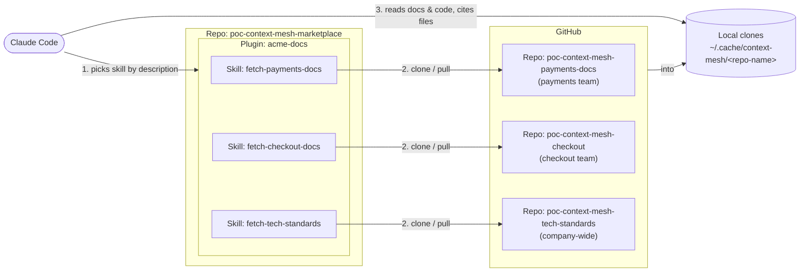

# poc-context-mesh-marketplace

A small Claude Code plugin marketplace that demonstrates the **fetch context skill** approach to sharing AI-consumable context across teams: each team keeps its docs in its own repo, and a thin plugin distributes a per-team skill that *fetches* those docs into a local cache on demand.

## What's in this POC

This marketplace repo, plus one docs repo per team (and one company-wide), each fetched by its own skill:

| Repo | Role |
|---|---|
| this one — `poc-context-mesh-marketplace` | Marketplace + the `acme-docs` plugin (one fetch skill per team) |
| [`poc-context-mesh-payments-docs`](https://github.com/asierba/poc-context-mesh-payments-docs) | Payments team's docs — fetched by `fetch-payments-docs` |
| [`poc-context-mesh-checkout`](https://github.com/asierba/poc-context-mesh-checkout) | Checkout team's service — a small working app (code) plus its team docs — fetched by `fetch-checkout-docs` |
| [`poc-context-mesh-tech-standards`](https://github.com/asierba/poc-context-mesh-tech-standards) | Company-wide tech standards (architecture, security, engineering), kept as an LLM wiki built from meeting transcripts — fetched by `fetch-tech-standards` |



## Try it

1. **Add this marketplace** in any Claude Code session:

   ```
   /plugin marketplace add asierba/poc-context-mesh-marketplace
   ```

2. **Install the plugin:**

   ```
   /plugin install acme-docs@acme
   ```

3. **Start a fresh session** in any directory — no project setup needed.

4. **Ask a domain question.** The matching skill should auto-fire from its description, run the shared `fetch.sh` with its team's repo URL, clone that repo into `~/.cache/context-mesh/<repo-name>/`, and cite specific files when answering. Try:

   Payments:
   - *"What HTTP status do I get if I reuse an idempotency key with a different body?"* (expect: 409)
   - *"What's a merchant currency lock?"*
   - *"Can I take payments in two different currencies for the same merchant?"*

   Checkout:
   - *"What does checkout check before capturing payment, and what happens if that service is down?"* (expect: inventory; fails closed with 503)
   - *"Which events does checkout emit and who consumes them?"* (expect: `order.placed` / `order.cancelled`; fulfilment, inventory, notifications, analytics)
   - *"What happens if checkout crashes after charging the card but before saving the order?"* (expect: orphan charge; idempotency key `chk_<cart_id>` prevents double charge; nightly reconciliation)
   - *"The outbox lag alert is firing. What do I do?"* (expect: Sev2, `runbooks/outbox-backlog.md`, don't truncate the outbox)

   Tech standards (company-wide):
   - *"Can I use MySQL for a new service?"* (expect: no — Hold, use Postgres)
   - *"Where do secrets go and how often are DB credentials rotated?"* (expect: AWS Secrets Manager, 30 days)
   - *"Can I put a customer's email in a Kafka event?"* (expect: Confidential — only to consumers with a documented need)

   Cross-skill:
   - *"Does checkout's stack comply with our tech radar?"* (expect: yes except Next.js — on Trial via ADR 0001)
   - *"Does checkout follow the company's architecture principles? List any deviations."* (expect: 5 s payments timeout via exception ADR 0003; no circuit breaker; no `Idempotency-Key` header)
   - *"Is it OK that checkout puts customer_email in order.placed?"* (expect: Confidential, allowed — notifications has a documented need)
   - *"Does checkout handle every payments error code correctly?"* (expect: 402/409 not retried, 429 retried up to 3 times, matching payments' rules)
   - *"Which of checkout's ADRs need action soon?"* (expect: ADR 0003 expires 2026-11-15; exception ADRs last 12 months)

   The skill is provided entirely by the installed plugin — no `.claude/` config in the working directory.

## What this validates

- **Description-driven discovery.** The agent picks the skill from its description, not from a central index.
- **On-demand fetch.** Docs stay in each team's repo; the plugin only ships a thin cloner.
- **Decoupled publish cycle.** Doc edits land in the team's repo with no plugin re-release. The plugin re-releases only when the fetch behaviour itself changes.
- **Cache reuse.** First invocation clones; subsequent invocations fast-forward.

## Layout

```
.claude-plugin/marketplace.json     ← marketplace manifest
acme-docs/                          ← the plugin
├── .claude-plugin/plugin.json
├── shared/
│   ├── fetch.sh                    ← clone-or-pull: fetch.sh <repo-url>; caches under the repo name, prints the cache path
│   └── instructions.md             ← how to read the cache and answer — common to every skill
└── skills/
    ├── fetch-payments-docs/SKILL.md    ← description + fetch command with the team's repo URL
    ├── fetch-checkout-docs/SKILL.md
    └── fetch-tech-standards/SKILL.md   ← company-wide repo
```

Each `SKILL.md` holds only what differs per team: its description (which drives discovery), its repo URL, and optional hints. Shared files are referenced via `${CLAUDE_PLUGIN_ROOT}`.

To add another team (e.g., inventory), drop a `fetch-inventory-docs/SKILL.md` alongside the others.

## Future improvements

This is a proof of concept. Things a real setup would add:

- **Evals.** A set of questions with expected answers per team (like the ones in [Try it](#try-it)), run in CI whenever a skill description, the shared instructions, or a team's docs change. Catches skills that stop triggering, wrong skill choices, and answers that drift from the docs.
- **Restrict what `fetch.sh` clones.** Today it clones whatever URL it's given; only allow repos from the company's GitHub organisation.
- **Pin versions when reproducibility matters.** Fetch a tag or commit instead of the latest `main`, so answers can be traced to a known version of the docs.
- **Docs freshness and drift checks.** Agents that flag docs contradicting the code, or team docs contradicting the tech standards — the mismatches the test sessions found by hand.
- **Team-owned skill descriptions.** Let each team own its skill's description (it drives discovery) without going through the platform team.

## Addendum: background

Teams that own a domain should own its docs, and choose which part of them other teams can see. The question is how that public surface reaches consuming teams' agents. Common options, roughly in order of capability:

| Substrate | How context travels | Tradeoff |
|---|---|---|
| Monorepo filesystem | Direct reads of each team's `docs/` | Zero mechanics; breaks once teams split repos |
| Git submodule | Consumers submodule a shared or per-team docs repo | No registry; manual updates, no versioning |
| Plugin — **fetch context skill** *(this POC)* | Plugin ships a thin cloner; content stays in producer repos | Always fresh, no re-release on doc edits; not reproducible |
| Plugin — bundled content | Plugin ships versioned doc snapshots | Reproducible, atomic releases; content moves at plugin cadence |

This POC uses the **single plugin, one fetch skill per team** variant: one install gives access to every team, and adding a team means adding one more thin skill.
